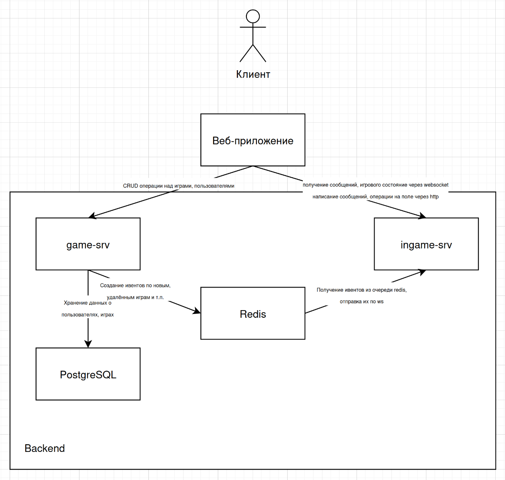

# ms4me | CTF Attack-Defense service

ms4me представляет из себя сервис для CTF формата Attack-Defense, который содержит чекер совместимый с жюрейной системой [ForcAD](https://github.com/pomo-mondreganto/ForcAD).

## Оглавление

1. [Описание](#описание)
2. [Запуск](#запуск)
3. [Структура директорий сервиса](#структура-директорий-сервиса)
4. [Диаграмма](#диаграмма)
5. [Уязвимости](#уязвимости)
6. [Чекер](#чекер)

## Описание

Сервис представляет из себя онлайн игру "Сапёр".

Функциональные возможности сервиса:
- Создание игр (публичные/приватные)

    Приватные игры доступны по ссылке. Доступ к ним можно получить только зная id игры.

- Отображения списка игр в realtime

    Основной страницей является список игр, который содержит две вкладки:
    - Все игры
    - Мои игры - текущие игры, а также история предыдущих игр
    
    На основной странице игрок также подключается по websocket к серверу, чтобы список игр актуализировался по мере их добавления

- Внутриигровой чат

    В игровых комнатах есть чат. Жизнь сообщений в нём 20 минут, после чего сообщения удаляются. Также историю сообщений можно посмотреть после игры во вкладке "Мои игры".

- Отображения игрвого поля в realtime

    Во время входа в игру устанавливается websocket соединения. Далее по нему передаются все данные для отрисовки поля.

Сервис содержит следующие микросервисы:
- game-srv - сервис необходимый для CRUD операций над играми, вывода в виде списка их, поиска и т.п. Также управляет пользователями и добавляет игроков в игры
- ingame-srv - сервис необходимый для realtime действий, таких как чат, действия на игровом поле и т.п. Также сервис имеет http ручки для взаимодействия с полем и чатом.
- База данных PostgreSQL - используется для хранения персистентных данных: пользователи, игры, игроки
- База данных Redis - используется для хранения временных данных: текущая информация об игроках в игре, состояние игрового поля, чат.

Также стоит отметить:
- Сервис game-srv иногда обращается к ingame-srv напрямую, чтобы получить информацию о состоянии готовности игры.
- Сервис ingame-srv иногда обращается к game-srv напрямую. Это нужно для закрытия игры после получения информации о ивенте, который сообщает, что игра завершилась, а также для получения статуса игры из основной БД.

Сервис ingame-srv не осуществляет каких-либо операций создания/изменения. Он необходим только лишь для realtime уведомлений пользователей на игровом поле/в чате.

Сервис не содержит как такового auth сервиса, поэтому в качестве упрощения game-srv и ingame-srv для авторизации пользователей оба валидируют у себя токены одним и тем же секретом.

Хранение флага подразумевается в чате игры.

## Запуск

```bash
cd service
chmod +x start.sh
./start.sh
```

## Структура директорий сервиса

Проект состоит из нескольких основных компонентов:

- `service/deploy/`: Dockerfile'ы для запуска сервисов
- `service/game_front/`: Frontend, React
- `service/game-srv/`: Микросервис game-srv для CRUD операций над играми, пользователями
- `service/ingame-srv/`: Микросервис для realtime информации в игре, чате
- `service/migrations/`: Миграции для PostgreSQL
- `service/docker-compose.yml`: Docker-compose конфиг, который запускает все сервисы
- `service/start.sh`: Скрипт для запуска сервисов

## Диаграмма



## Уязвимости

Сервис содержит 2 уязвимости. Разбор уязвимостей и эксплойты можно посмотреть [тут](writeup/).

## Чекер

Чекер находится [тут](checker/). Был протестирован на проверяющей системы [ForcAD](https://github.com/pomo-mondreganto/ForcAD).