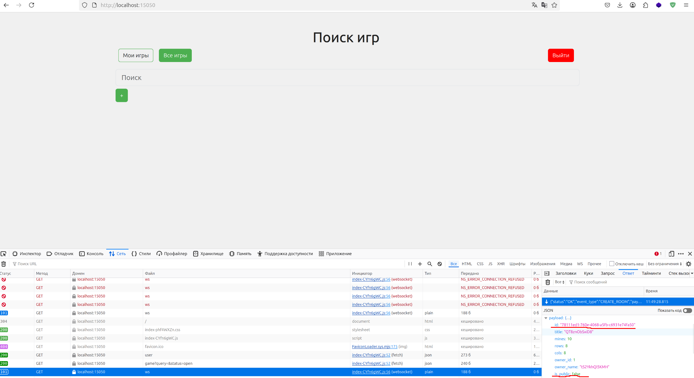

# Writeup | ms4me

## IDOR в получении сообщений из игрового чата

### Описание

В эндпоинте /ingame/api/v1/game/{id}/chat отсутсвует проверка принадлежности пользователя к игре, к чату которой он обращается. Это позволяет любому пользователю получить сообщения из чата, зная его id.
```bash
curl http://<ip>:15050/ingame/api/v1/game/{id}/chat -H "Cookie: token=<token>"
```
id чата можно получить с помощью вторичной уязвимости. Находясь в меню поиска игр, прослушивая вебсокет, можно заметить, что все ивенты создания игр прилетают пользователю вне зависимости от того, публичная ли это игра или нет.

В ивенте палится id обновлённой комнаты, в том числе приватной.

Прослушивая вебсокет, можно получить id игры, после чего использовать его для эксплуатации уязвимости выше.

Пример эксплойта можно найти [тут](./sploits/1.py)

### Патч

1. Быстрым патчем будет сделать так, чтобы ивент прилетал только от создания публичных игр в ingame-srv/internal/service/eventloop/eventloop.go:

```go
if event.IsPublic {
    go s.ws.BroadcastEvent(resp)
}
```

Тем самым злоумышленник уже не получит id игры через websocket.

2. Лучшим патчем будет закрыть IDOR на получение сообщений из чата проверкой, что пользователь, который пытается получить сообщения, действительно участник игры.

Тут необходимо перед запросом сходить в Postgres и проверить, что игрок с user_id действительно есть в таблице players и ему соответствует игра с game_id, от которой он хочет получить чат.

## SSTI приводящая к смене пароля

### Описание

В эндпоинте /game/api/v1/game/{id}/congratulation содержится функционал генерации сообщения о поздравлении победителя в игре.

Сам эндпоинт вызывается по окончанию соревнования у клиента, который является победителем. В ответе на запрос содержится поздравление победителю. Оно генерируется на сервере через html/template.

В шаблон поступает пользовательский ввод. Также следует обратить внимание на то, что в качестве контекста шаблона передаётся структура, которая содержит данные о игре, а также структура, которая содержит методы сервисного слоя приложения.
```go
tmplStr := fmt.Sprintf("Игра {{ .Title }} завершена!\nПоздравляем победителя %s!", winner.Username)

tmpl, err := template.New("congratulation").Parse(tmplStr)
if err != nil {
    log.Error("template parse error", prettylogger.Err(err))
    return nil, ErrTemplate
}
buf := bytes.NewBuffer(nil)
if err := tmpl.Execute(buf, struct {
    *Game
    *models.GameDetails
}{
    Game:        h,
    GameDetails: game,
}); err != nil {
    log.Error("template execute error", prettylogger.Err(err))
    return nil, ErrTemplate
}
```

Структура **Game** помимо прочего имеет поле DB, которое содержит в себе интерфейс для обращения к БД. В интерфейсе есть метод **ChangePassword**, позволяющий сменить пароль пользователю.

```go
type GameStorage interface {
	CreateGame(ctx context.Context, game *models.Game, userID int64) (string, error)
	GetGames(ctx context.Context, filter *gamedto.GetGamesRequest) ([]*models.Game, error)
	GetGameByID(ctx context.Context, id string) (*models.GameDetails, error)
	GetGameByIDUserID(ctx context.Context, id string, userID int64) (*models.GameDetails, error)
	UpdateGame(ctx context.Context, id string, userID int64, game *models.Game) error
	DeleteGame(ctx context.Context, id string, userID int64) error
	ChangePassword(username, password string) error
	StartGame(ctx context.Context, id string, userID int64) error
	EnterGame(ctx context.Context, id string, userID int64) error
	ExitGame(ctx context.Context, id string, userID int64) error
	GetUserGames(ctx context.Context, userID int64) ([]*models.Game, error)
	UpdateGameStatus(ctx context.Context, id string, status string) error
	UpdateWinner(ctx context.Context, id string, winnerID int64) error
	GetUserByID(ctx context.Context, id int64) (*models.User, error)
}

type Game struct {
	log *slog.Logger
	DB  GameStorage
	rdb *redis.Redis
	gc  *ingameclient.IngameClient
}
```

Теперь у нас есть всё, чтобы изменить пароль пользователю и зайти в его аккаунт:

1. Создаём аккаунт с именем {{ .DB.ChangePassword "<victim_username>" "bcrypt_hash(<new_password>)" }}
Здесь важно, чтобы вторым аргументом подавалась строка с хэшем пароля
2. Создаём ещё один аккаунт для второго пользователя с произвольными данными
3. Создаём игру, в которую входят оба пользователя
4. Игру выигрывает первый пользователь
5. Делаем запрос на /game/api/v1/game/{id}/congratulation
6. Заходим под <victim_username> с новым паролем
7. Получаем чат игры, в котором находится флаг

Пример эксплойта можно найти [тут](./sploits/2.py)

### Патч

Необходимо убрать прямой пользовательский ввод из шаблонизатора, а также перестать передавать в контекст шаблона структуру Game.

```go
tmplStr := "Игра {{ .Title }} завершена!\nПоздравляем победителя {{ .OwnerName }}!"

tmpl, err := template.New("congratulation").Parse(tmplStr)
if err != nil {
    log.Error("template parse error", prettylogger.Err(err))
    return nil, ErrTemplate
}
buf := bytes.NewBuffer(nil)
if err := tmpl.Execute(buf, game); err != nil {
    log.Error("template execute error", prettylogger.Err(err))
    return nil, ErrTemplate
}
```